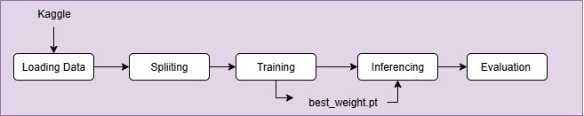
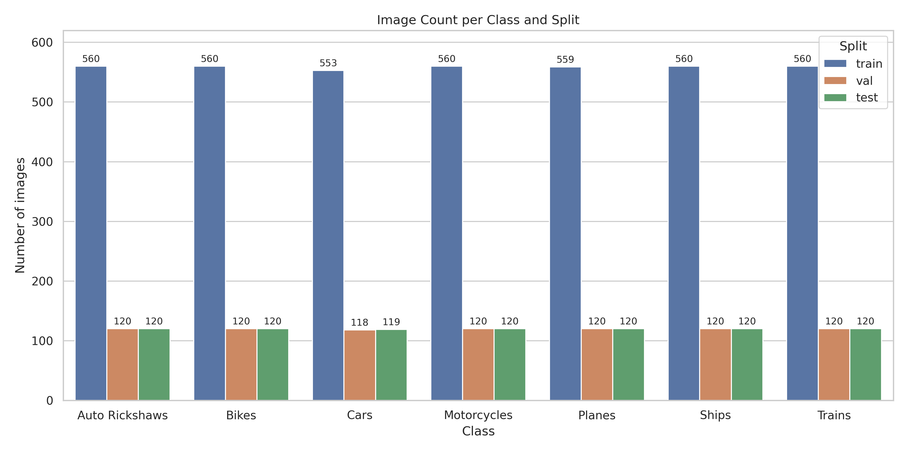
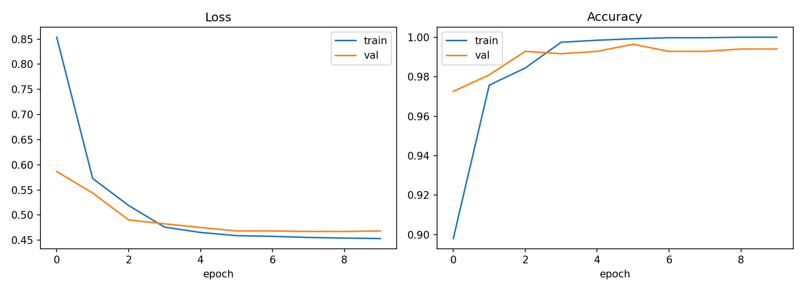
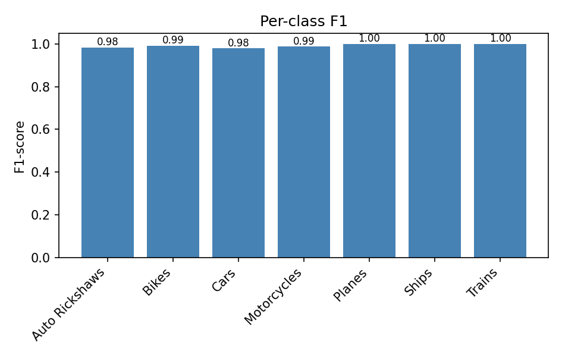
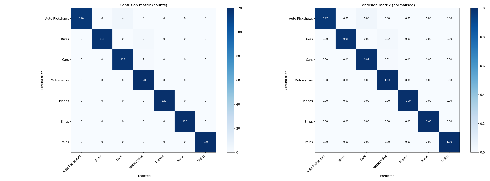
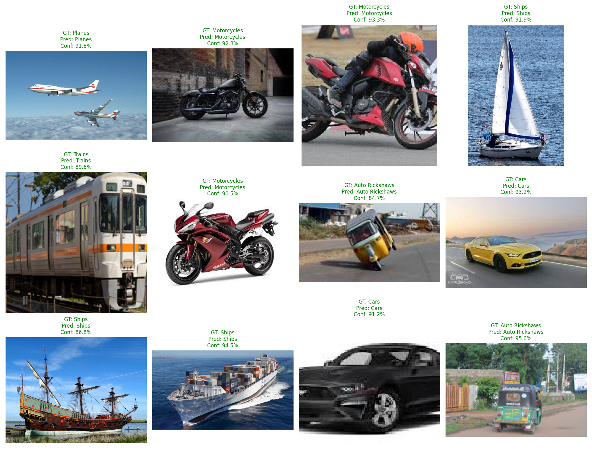
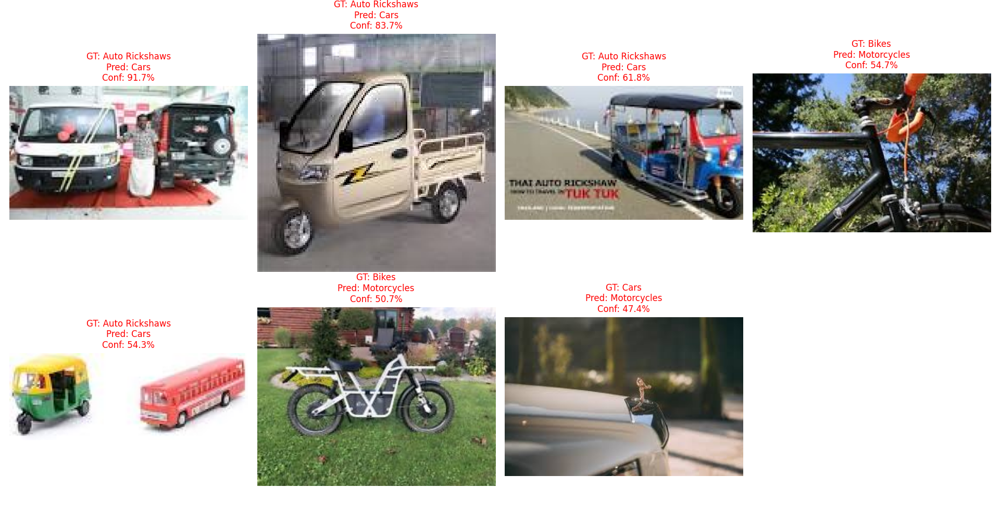

# Vehicle Classification — Example Use Case

> Classify a vehicle image into one of 7 classes using **ResNet-50 transfer learning and fine-tuning**.

## Table of Contents

1. [Overview](#1-overview)
2. [Project Idea](#2-project-idea)
3. [Problem Definition](#3-problem-definition)
4. [Dataset](#4-dataset)
5. [Model](#5-model)
6. [Project Structure](#6-project-structure)
7. [Reproduce the Pipeline](#7-reproduce-the-pipeline)
8. [Results](#8-results)
9. [Included Outputs](#9-included-outputs)
10. [Limitations and Future Work](#10-limitations-and-future-work)

---

## 1. Overview

Vehicle Classification is one example of the generic image classification pipeline. The same workflow is used for any dataset:



---

## 2. Project Idea

| Item | Description |
|---|---|
| **Project** | Vehicle Image Classification |
| **Application domain** | Transportation and smart mobility (traffic monitoring, vehicle cataloguing, automated image tagging) |
| **Task type** | Multi-class image classification |
| **Dataset** | Public dataset: [Kaggle Vehicle Classification](https://www.kaggle.com/datasets/mohamedmaher5/vehicle-classification)  |
| **Pretrained model** | ResNet-50 with ImageNet weights |
| **Approach** | Transfer learning followed by fine-tuning |

This project uses a public dataset and a pretrained model, and adapts the model to a new task through transfer learning and fine-tuning.

---

## 3. Problem Definition

### 3.1 The problem

Sorting large collections of vehicle images by hand is slow, repetitive and error-prone. Vehicles also look very different across types (a plane and a ship, or a bike and a motorcycle), and the same type can vary in angle, lighting, background and image quality. Some classes, such as *Bikes* and *Motorcycles*, are visually similar and easy to confuse.

### 3.2 Purpose of the system

The system automatically recognises which type of vehicle appears in an image. It shows how a model pretrained on general images (ImageNet) can be adapted to a specific domain with a small amount of training. It can serve as a building block for:

- Automatic tagging and organisation of vehicle image libraries
- Traffic and transport analysis
- Filtering or routing images by vehicle type

### 3.3 Input and expected output

| | Description |
|---|---|
| **Input** | A single RGB image containing a vehicle, resized to 224 × 224 |
| **Output** | The predicted class label and a confidence score (softmax probability) |
| **Classes (7)** | Auto Rickshaws, Bikes, Cars, Motorcycles, Planes, Ships, Trains |


### 3.4 Evaluation

Performance is measured on a held-out test set (15% of the data) using accuracy, per-class precision, recall and F1-score, and a confusion matrix. These show where the model performs well and which classes it confuses.

---

## 4. Dataset

| Dataset | Source | # of Classes | Size | Classes |
| --- | --- | ---: | ---: | --- |
| Vehicle Classification Dataset | [Kaggle](https://www.kaggle.com/datasets/mohamedmaher5/vehicle-classification) | **7** | **5,589** | Auto Rickshaws, Bikes, Cars, Motorcycles, Planes, Ships, Trains |

**Data split**

| Split | Share | Size | Purpose |
|---|---:|---:|---|
| `train` | 70% | 3,912 | Learn the model weights |
| `val` | 15% | 838| Tune training and select the best checkpoint |
| `test` | 15% |839 | Final, unbiased evaluation |

#### Class Distribution Over Splits

---

## 5. Model

| Configuration | Value |
|---|---|
| Architecture | ResNet-50 |
| Pretrained weights | ImageNet |
| Training strategy | Transfer learning + fine-tuning (first 2 epochs with the backbone frozen) |
| Epochs | 10 |
| Input size | 224 × 224 |
| Saved model | `use-case/vehicle_classification/outputs/best_model.pth` |

---

## 6. Project Structure

```text
use-case/vehicle_classification/
├── dataset/                     # Raw dataset from load_data.py (one folder per class)
│   ├── Auto Rickshaws/
│   ├── Bikes/
│   ├── Cars/
│   ├── Motorcycles/
│   ├── Planes/
│   ├── Ships/
│   └── Trains/
├── data/                        # Output of split.py
│   ├── train/                   # 70%
│   ├── val/                     # 15%
│   └── test/                    # 15%
└── outputs/
    ├── best_model.pth           # Best fine-tuned ResNet-50 weights
    ├── history.json             # Per-epoch training/validation metrics
    ├── tuning_curves.png        # Training curves
    ├── inference/
    │   └── predictions.json     # Saved predictions from inference.py
    └── eval/
        ├── metrics.json
        ├── predictions.json
        ├── confusion_matrix.png
        ├── per_class_f1.png
        └── vis/                 # Correct / wrong prediction grids
```

| Folder / File | Created by | Description |
|---|---|---|
| `dataset/` | `load_data.py` | Raw images, one sub-folder per class |
| `data/` | `split.py` | Train / val / test split, each with class sub-folders |
| `outputs/best_model.pth` | `train.py` | Best checkpoint (includes class names and image size) |
| `outputs/history.json`, `tuning_curves.png` | `train.py` | Training history and curves |
| `outputs/inference/` | `inference.py` | Saved predictions |
| `outputs/eval/` | `evaluation.py` | Metrics, plots and prediction visualisations |

---

## 7. Reproduce the Pipeline

The project can be used in two ways:

1. **Full Pipeline** — download the dataset, split the data, train/fine-tune the model, run inference, and evaluate the results.
2. **Inference Only** — use the provided trained model to classify a single image or flder of images . 

### 7.1 Full Pipeline

Run the following steps in order.

#### 7.1.1 Load the dataset

```bash
python load_data.py \
    --dataset mohamedmaher5/vehicle-classification \
    --out use-case/vehicle_classification/dataset
```

#### 7.1.2 Split

```bash
python split.py \
    --src use-case/vehicle_classification/dataset \
    --dst use-case/vehicle_classification/data \
    --train 70 \
    --val 15 \
    --test 15
```

#### 7.1.3 Train / fine-tune

```bash
python train.py \
    --data_dir use-case/vehicle_classification/data \
    --arch resnet50 \
    --epochs 10 \
    --freeze_epochs 2 \
    --out_dir use-case/vehicle_classification/outputs
```

#### 7.1.4 Inference

Run inference on the test set:

```bash
python inference.py \
    --image use-case/vehicle_classification/data/test \
    --weights use-case/vehicle_classification/outputs/best_model.pth \
    --out use-case/vehicle_classification/outputs/inference/predictions.json
```

This generates:

```text
outputs/inference/
├── predictions.json
└── predictions.csv
```

#### 7.1.5 Evaluation

```bash
python evaluation.py \
    --predictions use-case/vehicle_classification/outputs/inference/predictions.json \
    --out_dir use-case/vehicle_classification/outputs/eval
```

---

### 7.2 Inference Only

If you want to use the trained model  , you can skip dataset loading, splitting, training, and evaluation.

The `inference.py` script supports both **single-image inference** and **folder inference**.

#### Single Image

To classify one image, provide the image path and the trained model weights:

```bash
python inference.py \
    --image "use-case/vehicle_classification/data/test/Bikes/Bike (8).jpg" \
    --weights "use-case/vehicle_classification/outputs/best_model.pth"
```

Example output:

```text
Prediction
------------------------------
Image:      use-case\vehicle_classification\data\test\Bikes\Bike (8).jpg
Prediction: Bikes
Confidence: 93.21%

Top predictions:
  Bikes                93.21%
  Ships                1.45%
  Auto Rickshaws       1.30%
```

For a single image, the prediction is **printed directly to the terminal**. No JSON or CSV file is created.

#### Folder Inference

To classify all images inside a folder:

```bash
python inference.py \
    --image "use-case/vehicle_classification/data/test" \
    --weights "use-case/vehicle_classification/outputs/best_model.pth" \
    --out "use-case/vehicle_classification/outputs/inference/predictions.json"
```

Folder inference saves:

```text
outputs/inference/
├── predictions.json
└── predictions.csv
```

The saved predictions can then be passed to `evaluation.py` if ground-truth labels are available.

---

## 8. Results

### 8.1 Training curves



### 8.2 Per-class F1



### 8.3 Confusion matrix




### 8.9 Successful and Failed Cases

#### Successful Cases

#### Failed Cases

---

## 9. Included Outputs

The repository includes the trained vehicle classification model and example evaluation results:

- Training history and curves
- Inference predictions
- Accuracy and classification metrics
- Confusion matrix
- Per-class F1
- Correct and incorrect prediction visualisations

---

## 10. Limitations and Future Work

### 10.1 Current limitations

This is **image classification**, not object detection. The model assigns one label to the whole image. It does not locate or count vehicles, and images containing several vehicle types may produce unreliable predictions.

### 10.2 Future work: detection + classification on CCTV

The project can be extended into a full two-stage pipeline:

```text
CCTV Frame → Vehicle Detection → Crop Each Vehicle → Classification → Class + Confidence per Vehicle
```

1. **Detection first:** an object detector (for example YOLO) finds every vehicle in the frame and returns bounding boxes.
2. **Classification second:** each detected vehicle is cropped and passed to the fine-tuned ResNet-50 classifier, which predicts its type.

For real-world use, the models should be trained and fine-tuned on **CCTV camera data** rather than only clean, curated images. CCTV footage brings challenges the current dataset does not cover:

- Low resolution and video compression artifacts
- Night-time, glare, rain and fog
- Unusual camera angles and long distances
- Partially hidden or overlapping vehicles
- Motion blur

Training on this kind of data would make the system more robust and suitable for traffic monitoring, vehicle counting and smart-city applications.


## Credits

**Author:** Renad Alsaif

This project was developed by **Renad Alsaif** as part of the **SDAIA Academy** program.

**SDAIA Academy:** https://github.com/SDAIAAcademy
